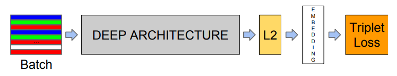
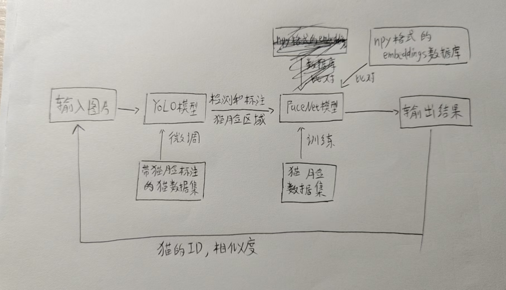
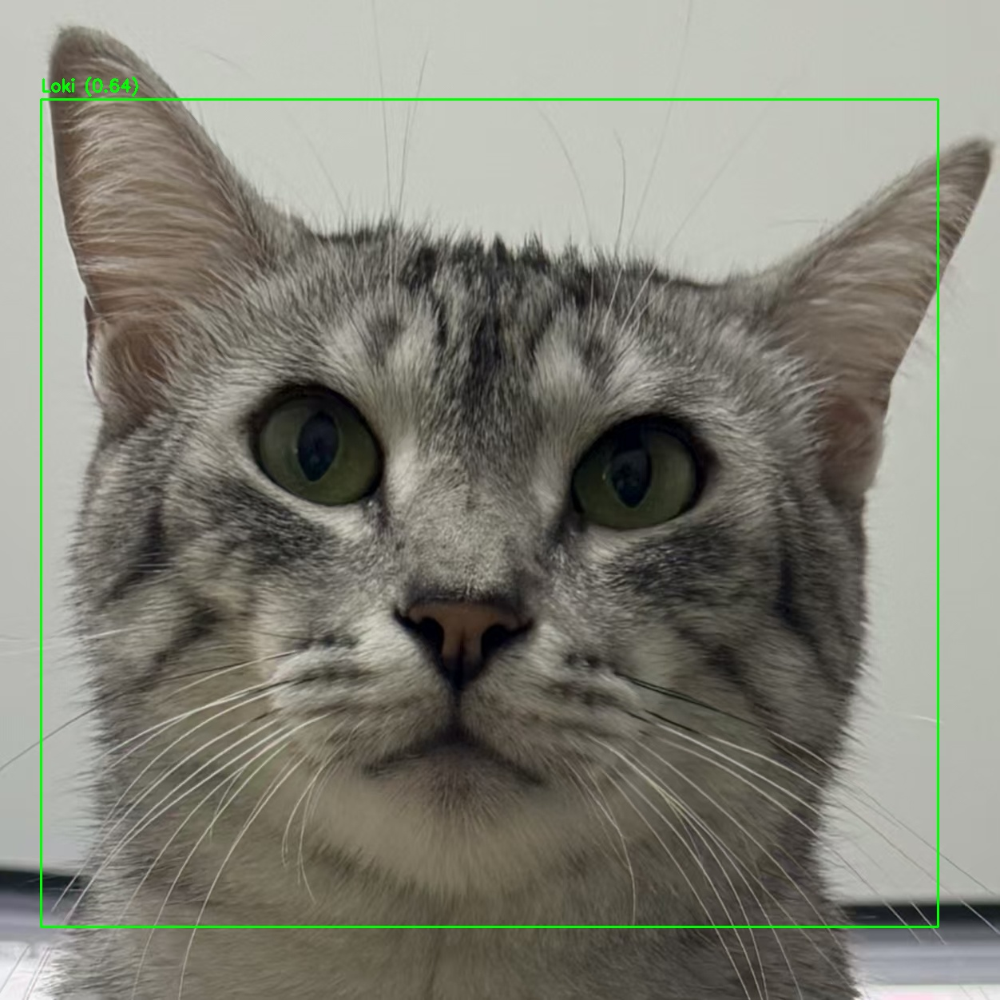
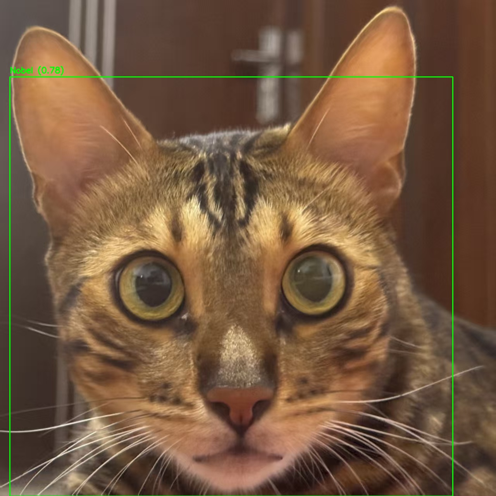
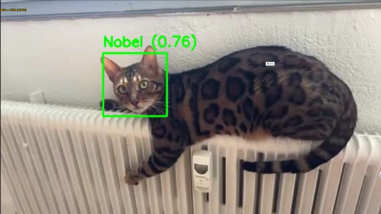

# 基于FaceNet的猫脸识别


## 项目初衷和背景
在城市中，流浪猫数量逐年增加，但传统的流浪动物管理方式主要依赖人力巡查、
个体标记和经验判断，效率低下且缺乏连续性。部分居民或志愿者会设置喂食点，
但无法准确监控猫的个体情况，导致：
- 猫只重复喂食或漏食；
- 疾病无法追踪；
- 无法识别或找回走失猫；
- 人猫冲突增加，影响社区关系。

本项目旨在构建一个基于猫脸识别技术的智能喂食器系统，具备以下公益价值：
自动记录喂食行为与个体信息；协助识别流浪猫个体，追踪活动轨迹；支持走失
猫寻找（由主人上传照片进行比对）；采集区域性猫群分布数据，为流浪动物管
理提供科学参考。
系统整体特征为：无需佩戴装置、仅通过单张猫脸照片即可识别个体。除了使用图片进行检测，也可使用视频或实时监控的方式进行部署。

## 核心技术栈介绍
### 1、FaceNet 原理简介
FaceNet（Google, 2015）是用于人脸识别和聚类的深度学习模型，其目标不是
分类，而是学习一个 embedding 函数：
每张脸被映射为一个固定长度向量；
同一个体的图像向量距离小；
不同个体的图像距离远。
Facenet的网络架构演示图：

在该项目中，借鉴FaceNet的思想将其核心逻辑从人脸识别迁移到猫脸识别场景中。

### 2、Triplet Loss：训练的核心方法
训练使用三张图组成的 triplet：
Anchor：一张猫脸图；
Positive：同一只猫的另一张图；
Negative：不同猫的一张图。
优化目标：
||f(A)- f(P)||² + α < ||f(A)- f(N)||²
其中α是 margin（通常为 0.2），确保同类距离更近，不同类距离更远。

#### Triplet数据集构建方法
(1) 数据采集与目录结构
从网络公开数据构建如下目录结构：
```text
/cat_faces/
├── cat_001/
│ ├──001_1.jpg
│ ├──001_2.jpg
├── cat_002/
│ ├──002_1.jpg
│ ├──002_2.jpg
├── ...
```
每只猫 ≥2 张不同角度/状态图像,Positive数据可以使用Anchor的图像增强
（下边3），随机从数据集里筛选不同的另一只猫作为Negative数据。

(2) Triplet 构建逻辑
可采用在线动态采样方式（训练时实时构建 triplets）：
Anchor: random from cat_001
Positive: another from cat_001
Negative: random from cat_002, cat_003...

(3) 图像预处理方式
固定尺寸裁剪（如 224×224）
图像增强（左右翻转、亮度变换、轻度旋转）
图像中心裁剪/resize，无需 landmark 对齐

### 3、YOLO检测与锁定猫脸区域
考虑到该系统在部署时，所要检测的图片，视频等**不一定为理想的猫脸头像**，实际情况往往是猫占据场景中的一部分，
此时输入系统的图像容易被背景干扰，极大影响准确率。于是在输入图片进入FaceNet模块前，使用YOLO模型对输入图片进行
处理，目标是**精准检测和标注出图片中的猫脸区域**，之后将该标注区域作为FaceNet模块的输入图片，由此提高最终识别的准确性。

## 项目架构
输入图片-微调的YOLO模型（检测图片中的猫脸区域，输入为系统原始输入图片，输出为检测到的猫脸区域位置）- FaceNet模型（猫脸识别的核心部分，输入YOLO模型提供的猫脸区域信息和npy文件格式的embedding数据库，输出猫脸识别结果：猫的名字和相似度或未知）-输出识别结果

- 微调的YOLO模型：YOLO模型本身基于COCO数据集80类，此处需微调为一类（猫脸），微调的数据集建议为带猫脸标注的一般猫的图片。
- npy格式的数据库：当FaceNet模型进行猫脸识别推理时，本质上是将输入图片的embeddings与一组embeddings比较取相似度最高的一对，
即需要提前准备猫脸的数据库才能使FaceNet在推理时可以通过数据库识别。


## 模型推理快速体验
使用main.py可以快速使用该项目模型的推理功能。

安装项目依赖：`pip install -r requirements.txt`

### 主要功能
1. 图片识别模式：识别单张图片中的猫，并标记身份

2. 视频处理模式：处理视频文件，识别每一帧中的猫

3. 实时监控模式：使用摄像头实时检测和识别猫

4. 特征数据库的构建：该脚本同时提供了生成临时数据库和使用已存在的数据库的功能。
若无数据库文件，则将要用于构建数据库的图片放于一个文件夹中，在main.py中使用-d参数，
则推理过程中会自动生成根据指定文件夹图片构建的临时npy文件（推理结束时自动清理）。
若要使用已存在的数据库文件，使用-db参数指定即可。注：若未使用-d和-db参数，将使用默认
的项目数据库。

### 参数说明
主要模式参数（三选一）：

`-i, --input-image`：处理单张图片

`-v, --input-video`：处理视频文件

`-mv, --monitor-video`：启动实时监控模式（注意：**按q键退出该模式**）

### 通用参数：
`-c, --camera`：摄像头设备ID或RTSP地址（默认：0）

`-o, --output`：输出路径（默认：detection_result）

`-m, --model`：ONNX模型路径（默认：models/facenet_model.onnx）

`-y, --yolo-model`：YOLO模型路径（默认：models/yolo_model.pt）

`-t, --threshold`：相似度阈值（默认：0.4）

`-d, --database-folder`：包含猫脸图片的文件夹，用于**生成临时npy特征数据库**

`-db, --database-path` :使用已有的特征向量数据库（默认：data/examples/embeddings/cat_db.npy）

### 使用示例
```python
# 图片模式：指定输入图片和输出目录
python main.py -i data/examples/profile/Loki.jpg -o ./detection_result 

# 视频模式：指定视频文件
python main.py -v data/examples/video/loki.mp4 

# 监控模式：使用默认摄像头（ID=0），注意：按q键退出监控
python main.py -mv 

# 指定图片和npy文件
python main.py -i data/examples/profile Loki.jpg -o ./result -db data/examples/embeddings/cat_db.npy

# 指定生成临时npy文件的文件夹
python main.py -i data/examples/profile Loki.jpg -o ./result -d data/examples/profile

```

## 全流程复现
该项目已经提供了组织好的猫脸数据集和用于微调YOLO的数据集(data/facenet_dataset和data/yolo_dataset)。
若自己准备数据集可参考其组织格式。

### （1）训练FaceNet模型
```python

# 默认训练10轮,训练模型和训练曲线保存在checkpoints/（可自行在脚本中修改）
python train_computer.py

# 将训练好的模型转化为ONNX格式(默认取训练结束后checkpoints/下保存的最佳模型)
python onnx_transform.py
```

### (2) 微调YOLO模型
#### 构建微调猫脸标注数据集
该项目使用LabelImg工具进行标注（可以直接输出符合YOLO格式的标注文件），LabelImg安装方式可自行研究。
标注目录参考：
```text
cat_dataset/
├── images/               # 存放所有图像文件
├── labels/               # 存放所有标注文件（如YOLO格式的.txt文件）
├── classes.txt           # 类别名称文件（每行一个类别名）

```
按如上方式组织项目目录，classes.txt中写一行：“cat_face”。Images用于存放待标记的图片，labels存放输出的标记文件。
标记完成后，需要将你标注的所有文件对应地划分为训练集和验证集，注意图像和标注文件要一一对应。图像和标注文件的存放目录
可以在配置文件中调整。


以下是该项目的组织方式：
```text
data/
├── yolo_datasets/
│   └── images/
│   │     ├── train/       # 训练集图像（160张）
|   |     ├── val/         # 验证集图像（40张）
│   │                  
│   └── labels/
│       ├── train/       # 训练集标注文件（160个）
│       └── val/         # 验证集标注文件（40个）
│               
config
├── cat_data.yaml # 数据集配置文件（如YOLO格式）
```

#### 微调YOLO模型
```python
python train_yolo.py #可在脚本中调整训练轮数，输出模型路径等参数
```
新版的YOLO模型微调会将训练可视化，训练好的模型权重保存在指定的项目目录下，
可自行查看和找到微调好的模型权重文件。

### （3）构建猫脸特征向量数据库数据库
假设你有一组猫脸图片，将这些猫脸图片存放于一个文件夹中，使用特征向量构建工具就可以构建
npy格式的数据库。这个操作需要使用一个已经训练好的onnx格式的模型。
```python
python embddings_store.py # 文件夹路径和输出目录可在脚本中调整
```

### （4）猫脸识别推理
使用你自己的猫脸图片和特征向量数据库，用main.py完成猫脸识别任务吧。

## 技术挑战
1. 模型的训练：该项目涉及多个模型的训练，这意味着需要准备合适的数据集并且对原始数据做特殊预处理以适应特定模型的训练，整个流程包括：自主寻找开源数据集，数据预处理，模型训练脚本构建和修理，训练模型，反复验证和测试优化。另外，考虑到项目的应用场景，模型的设计主要以轻量化为主，所以要特别选择其轻量的模型结构和设置方法。
2. 推理脚本的考量：为了实现项目的应用目的，需要为不同场景和不同功能编写不同的脚本，如单张图片处理，视频处理，监控功能等，每一个脚本都涉及多重的调用，需要长期完善和封装。
3. 树莓派的使用：树莓派是该项目落地使用的一个方向。想要正常地使用树莓派，不仅要对树莓派硬件本身的各种操作和设置有足够了解，而且在树莓派上测试代码需要更加注重轻量化，测试过程需要很大的耐心。然而，受限于硬件资源有限，该项目仅提供测试时使用的树莓派版本的代码，但不做深度讨论。
4. Git管理的开发：更好的代码管理不仅有利于开发者个人的高效开发，还对团队协作开发提供有力支持。Git是专业的开发者管理工具，此时代码库的规范性是重点，为了尽可能便于其他开发者利用，需要特别设计代码块的组织方式，使底层源代码封装，并额外编写示例代码便于开发者调用。


## 贡献
该项目主要以研究和提出概念为目的。项目基本覆盖了一个规范的项目开发流程，能很好的锻炼个人的开发能力。关于猫脸识别系统的开发仍然有改进空间，该项目可作为长期研究的内容持续更新。

项目成果展示：






## 参考资料
项目数据集：<https://www.kaggle.com/datasets/veeralakrishna/cat-faces-dataset>

其他参考github项目：<https://github.com/marando/pycatfd>

参考文献：Schroff, F. et al. "FaceNet: A Unified Embedding for Face Recognition and
Clustering." CVPR 2015


